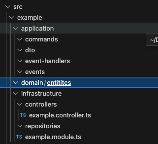

# 🧱 NestJS E-Commerce Architecture  
**CQRS + Hexagonal Architecture + Event-Driven Design**

---

## 🚀 Initialization Steps

```bash
npm i -g @nestjs/cli
nest new ecommerce
# Select pnpm for a faster installation of the modules.
cd ecommerce
pnpm install @nestjs/cqrs
pnpm install @nestjs/event-emitter
pnpm install uuid
pnpm install class-validator class-transformer
```
## Example src/ folder structure

```
src/
├── shared/
│   ├── domain/
│   │   ├── entities/
│   │   │   └── UUID.entity.ts
│   │   ├── errors/
│   │   │   ├── base.error.ts
│   │   │   └── invalid-uuid.error.ts
│   │   ├── value-objects/
│   │   └── repositories/
│   ├── application/
│   │   ├── commands/
│   │   ├── events/
│   │   ├── event-handlers/
│   │   └── dto/
│   ├── infrastructure/
│   │   ├── controllers/
│   │   ├── repositories/
├── user/
│   ├── domain/
│   │   ├── entities/
│   │   │   └── user.entity.ts
│   │   ├── value-objects/
│   │   └── repositories/
│   │       └── user.repository.interface.ts
│   ├── application/
│   │   ├── commands/
│   │   │   ├── create-user.command.ts
│   │   │   └── create-user.handler.ts
│   │   ├── events/
│   │   │   └── user-created.event.ts
│   │   ├── event-handlers/
│   │   │   └── send-welcome-email.handler.ts
│   │   └── dto/
│   │       └── create-user.dto.ts
│   ├── infrastructure/
│   │   ├── controllers/
│   │   │   └── user.controller.ts
│   │   ├── repositories/
│   │   │   └── user.in-memory.repository.ts
│   │   └── user.module.ts
├── app.module.ts
├── main.ts
```
### domain
```domain/``` – Pure Business Logic
- Entities: Core domain models like User
- Value Objects: Immutable, validated types like Email, PasswordHash
- Interfaces: Repository contracts (IUserRepository)

### application
```application/``` – Use Cases and Orchestration
- Commands: Action objects (e.g. CreateUserCommand)
- Handlers: Implement use cases (CreateUserHandler)
- Events: Domain events (UserCreatedEvent)
- Event Handlers: React to events (e.g. send email)
- ```DTOs```: Input validation (CreateUserDto)
### infastructure
```infrastructure/``` – Framework & Adapters
- Controllers: REST entry points
- Repositories: Real implementations (DB, cache, etc.)
- Modules: NestJS DI configuration

## How to start 
Creation of the ```UUID``` which is an implemtnation to encapsulate the ```uuid``` libary.

Creation of the ```base.error.ts``` which will be used by all the other errors so they must implement the message and have a common structure:
- ```message````fl
- ```statusCode````
- ```cause`````

Creation of the ```invalid-uuid.error.ts``` which will be throwed when an invalid uuid has been provided ad so an UUID can't be created.

For the implementation of the ```users``` folder within the ```src``` folder I have followed the steps described below:
- We define users.entity.ts within ```src/user/domain/entities/user.entity.ts```
- We define the value-objects related to the entity created.
  - UserId => UUID \
  ```src/user/domain/value-objects/userId.vo.ts```
  - UserName => String \
  ```src/user/domain/value-objects/userName.vo.ts```
  - UserEmail => String \
  ```src/user/domain/value-objects/userEmail.vo.ts```
  - .....
- Create the UserRepository Interface. \
 ```src/user/domain/interfaces/UserRepository.interface.ts```
- 